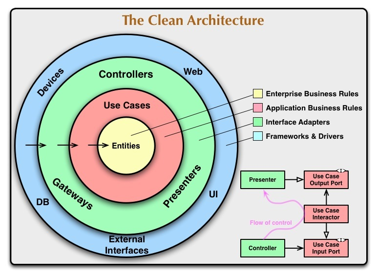

### バージョン（前提条件）

1. FVM バージョン: `2.4.1`
2. Flutter チャンネル: `stable`
3. Flutter バージョン: `3.3.10`
4. Java
   バージョン: `AdoptOpenJDK-11.0.11+9` 
5. Node
   バージョン: `16.16.0 LTS` 
6. Xcode バージョン: `14.2`

# 初めに

このプロジェクトは、新規プロジェクトです。

# I. ビルドの方法

1. `fvm flutter clean`

2. `make setup`

### 起動方法

1. Android Studio から、Environment を設定ください。 flavor: DEV

## 1. Flutter をインストールする

[Flutter インストール Web サイト](https://flutter.io/docs/get-started/install)の通りにインストールする
`fvm flutter doctor`を実行してすべてが正しく機能するかを確認する。

参照:

- http://clarkgrubb.com/makefile-style-guide
- http://marmelab.com/blog/2016/02/29/auto-documented-makefile.html

#### 新規プロジェクトインストール手順

1. 前提条件に通り、インストールしてください。
2. `make setup`コマンドを実行して、プロジェクトをインストールしてください。

# II. システムアーキテクチャ (Clean Architecture)

本プロジェクトは Clean Architecture に基づいて構築され、以下の 5 つの階層が含まれている。

- Data
- Domain
- UI
- Utils
- Config

## 3.システムアーキテクチャの詳細

### A. Clean Architecture の定義

### 3.1.Data

- Data モジュールとは、最外層であり、データの取得の役割がある。

### Data の内容

### Repositories

- Data 層のリポジトリは、domain 層のリポジトリから実装する必要がある。
- データベースまたは他の方法からデータを取得する。
- API 呼び出しと高レベルのデータを担当する。

### Models

- プラットフォームに依存する可能性のある追加メンバーの追加によるエンティティの拡張。

### 3.2.Domain

- Domain モジュールは、アプリケーションのビジネスロジックを定義する。 これは、開発プラットフォームから独立したモジュールである。
  つまり、プログラミング言語で記述されており、プラットフォームの要素は含まれていない。 理由としては、Domain
  はアプリケーションのビジネスロジックのみに注目し、実装の詳細には関係することではない。 これにより、問題が発生した場合にプラットフォーム間で簡単に移行することもできる。

---

### 3.2.1.Entities

- 企業全体のビジネスルール。
- メソッドを含むクラスで構成されている。
- アプリケーションのビジネスオブジェクト。
- アプリケーション全体で使用。
- アプリケーション内の何かが変更されたときに変更される可能性が最も低い。

#### 3.2.2.Repositories

- 外層の期待機能を定義する抽象クラス。
- 外層からユースケースに渡される。
- ドメインは最内層を表す。したがって、これはアーキテクチャの中で最も抽象的なレイヤーである。

---

### 3.3.UI

- ページの UI を表す。
- 状態管理：`hooks_riverpod`

### 3.4. Utils

- Utils フォルダーには、アプリケーション全体で使用される helpers、services、UI utils、検証ミックスインが含まれている。

### 3.5. Config

- 各フレーバーの動的変数を構成および定義する。

### 3.6. ライブラリ要件

# III.参照

- [アプリアーキテクチャガイド](https://blog.cleancoder.com/uncle-bob/2012/08/13/the-clean-architecture.html)
- [FVM のインストール](https://zenn.dev/altiveinc/articles/flutter-version-management#fvmのインストール)
